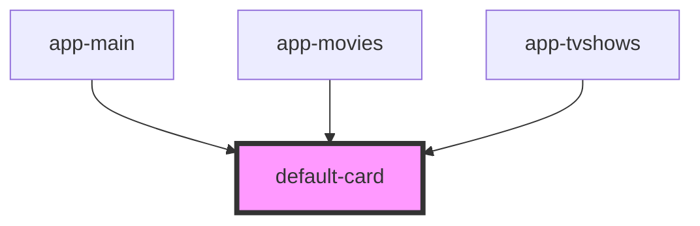

# default-card

<!-- Auto Generated Below -->

## Properties

| Property  | Attribute | Description | Type            | Default     |
| --------- | --------- | ----------- | --------------- | ----------- |
| `history` | --        |             | `RouterHistory` | `undefined` |
| `item`    | `item`    |             | `any`           | `undefined` |

## Dependencies

### Used by

 - [app-main](../../pages/app-main)
 - [app-movies](../../pages/app-movies)
 - [app-tvshows](../../pages/app-tvshows)

### Graph

----------------------------------------------

*Built with [StencilJS](https://stenciljs.com/)*
