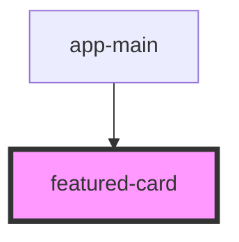

# featured-card

<!-- Auto Generated Below -->

## Properties

| Property    | Attribute    | Description | Type            | Default     |
| ----------- | ------------ | ----------- | --------------- | ----------- |
| `elementId` | `element-id` |             | `any`           | `undefined` |
| `history`   | --           |             | `RouterHistory` | `undefined` |
| `mediaType` | `media-type` |             | `any`           | `undefined` |

## Methods

### `goTo(e: any, route: any, data: any) => Promise<void>`

#### Returns

Type: `Promise<void>`

## Dependencies

### Used by

 - [app-main](../../pages/app-main)

### Graph

----------------------------------------------

*Built with [StencilJS](https://stenciljs.com/)*
