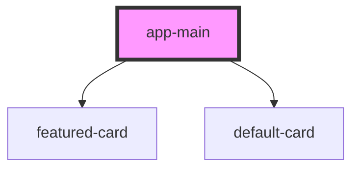

# app-main

<!-- Auto Generated Below -->

## Methods

### `showMore(amount: any) => Promise<void>`

#### Returns

Type: `Promise<void>`

## Dependencies

### Depends on

- [featured-card](../../cards/featured-card)
- [default-card](../../cards/default-card)

### Graph

----------------------------------------------

*Built with [StencilJS](https://stenciljs.com/)*
